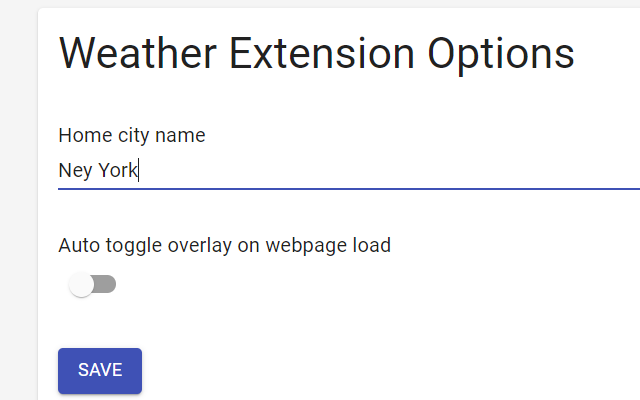
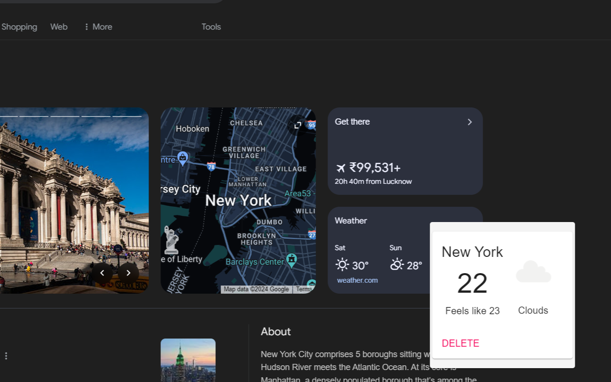
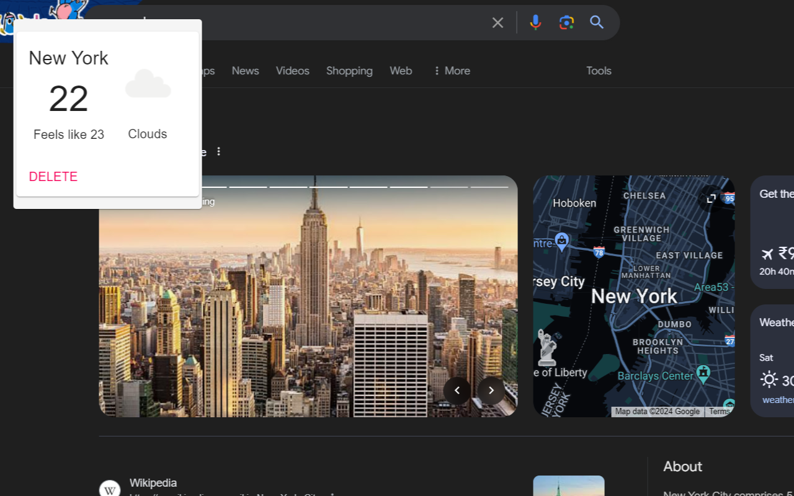
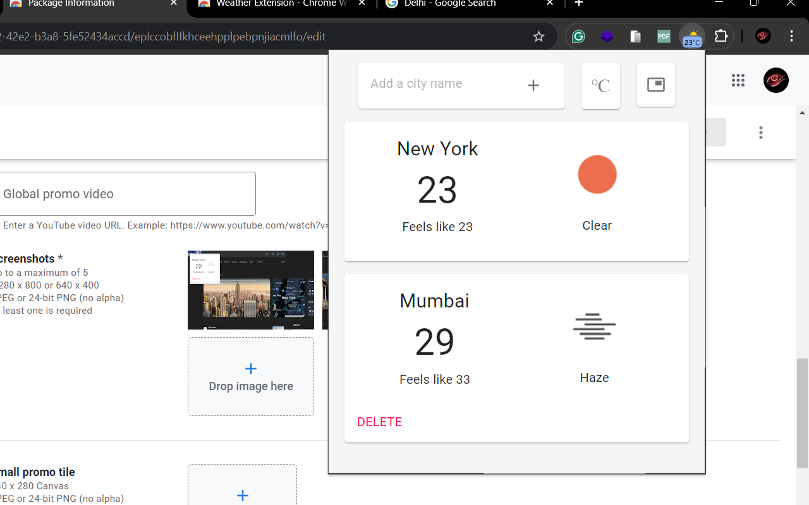
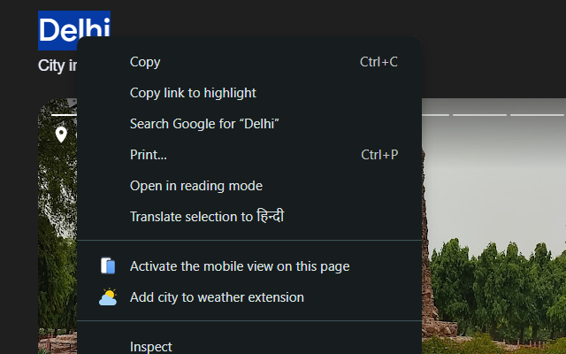

# Chrome Weather Extension

## Overview
This Weather Extension enhances your browsing experience by providing real-time weather information directly in your browser. It integrates seamlessly with websites, allowing you to view weather conditions for multiple cities, including your home city, and offers customizable features for a personalized experience.

## Images

## Features
- **API Calling**: Utilizes weather APIs to fetch current weather data.
- **Multiple Cities**: Add and track weather for multiple cities worldwide.
- **Script Injecting**: Injects scripts to display weather information on web pages.
- **Tabs Communication**: Ensures consistent weather updates across browser tabs.
- **App Overlay**: Overlays weather information on websites with drag-and-drop functionality.
- **Options Page**: Customizable options to set your home city and preferences.
- **Right-Click Integration**: Automatically adds city names via right-click context menu.

## Technology Stack
- **TypeScript**: Ensures robust and scalable code.

## Installation
To install the Weather Extension locally, follow these steps:
1. Clone the repository: `git clone https://github.com/mk0380/Chrome-Weather-Extension.git`
2. Run the command: `cd Chrome-Weather-Extension`
2. Run the command: `npm install`
3. Navigate to the extension settings in your Chrome browser.
4. Enable developer mode.
5. Load unpacked extension and select the cloned directory manifest.json directory.

## Usage
- **Adding Cities**: Right-click on any web page to add cities or use the options page.
- **Drag and Drop**: Drag the weather overlay to any position on the website.
- **Customization**: Configure options in the extension settings to personalize your weather view.
- **Real-Time Updates**: Enjoy up-to-date weather information without leaving your current tab.

## Support
For support, contact [mayankkr21@iitk.ac.in] or raise an issue on GitHub.
